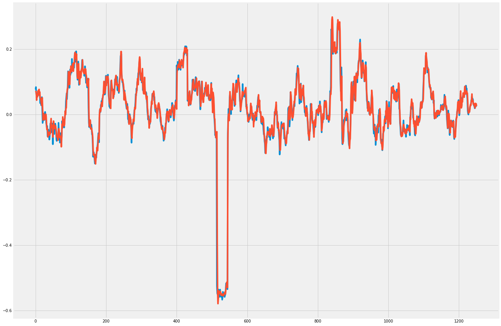

# bulbea
> *"Deep Learning based Python Library for Stock Market Prediction and Modelling."*

[](https://gitter.im/bulbea/bulbea) [](http://bulbea.readthedocs.io/en/latest/?badge=latest)


### Table of Contents
* [Installation](#installation)
* [Usage](#usage)
* [Documentation](#documentation)
* [Dependencies](#dependencies)
* [License](#license)

### Installation
Clone the git repository:
```console
$ git clone https://github.com/achillesrasquinha/bulbea.git && cd bulbea
```

Install necessary dependencies
```console
$ pip install -r requirements.txt
```

Go ahead and install as follows:
```console
$ python setup.py install
```

You may have to install TensorFlow:
```console
$ pip install tensorflow     # CPU
$ pip install tensorflow-gpu # GPU - Requires CUDA, CuDNN
```

### Usage
#### 1. Prediction
##### a. Loading
Create a share object.
```python
>>> import bulbea as bb
>>> share = bb.Share('YAHOO', 'GOOGL')
>>> share.data
# Open        High         Low       Close      Volume  \
# Date                                                                     
# 2004-08-19   99.999999  104.059999   95.959998  100.339998  44659000.0   
# 2004-08-20  101.010005  109.079998  100.500002  108.310002  22834300.0   
# 2004-08-23  110.750003  113.479998  109.049999  109.399998  18256100.0   
# 2004-08-24  111.239999  111.599998  103.570003  104.870002  15247300.0   
# 2004-08-25  104.960000  108.000002  103.880003  106.000005   9188600.0
...
```
##### b. Preprocessing
Split your data set into training and testing sets.
```python
>>> from bulbea.learn.evaluation import split
>>> Xtrain, Xtest, ytrain, ytest = split(share, 'Close', normalize = True)
```

##### c. Modelling
```python
>>> import numpy as np
>>> Xtrain = np.reshape(Xtrain, (Xtrain.shape[0], Xtrain.shape[1], 1))
>>> Xtest  = np.reshape( Xtest, ( Xtest.shape[0],  Xtest.shape[1], 1))

>>> from bulbea.learn.models import RNN
>>> rnn = RNN([1, 100, 100, 1]) # number of neurons in each layer
>>> rnn.fit(Xtrain, ytrain)
# Epoch 1/10
# 1877/1877 [==============================] - 6s - loss: 0.0039
# Epoch 2/10
# 1877/1877 [==============================] - 6s - loss: 0.0019
...
```

##### d. Testing
```python
>>> from sklearn.metrics import mean_squared_error
>>> p = rnn.predict(Xtest)
>>> mean_squared_error(ytest, p)
0.00042927869370525931
>>> import matplotlib.pyplot as pplt
>>> pplt.plot(ytest)
>>> pplt.plot(p)
>>> pplt.show()
```


#### 2. Sentiment Analysis
Add your Twitter credentials to your environment variables.
```bash
export BULBEA_TWITTER_API_KEY="<YOUR_TWITTER_API_KEY>"
export BULBEA_TWITTER_API_SECRET="<YOUR_TWITTER_API_SECRET>"

export BULBEA_TWITTER_ACCESS_TOKEN="<YOUR_TWITTER_ACCESS_TOKEN>"
export BULBEA_TWITTER_ACCESS_TOKEN_SECRET="<YOUR_TWITTER_ACCESS_TOKEN_SECRET>"
```
And then,
```python
>>> bb.sentiment(share)
0.07580128205128206
```

### Documentation
Detailed documentation is available [here](http://bulbea.readthedocs.io/en/latest/).

### Dependencies
1. quandl
2. keras
3. tweepy
4. textblob

### License
This code has been released under the [Apache 2.0 License](LICENSE).
