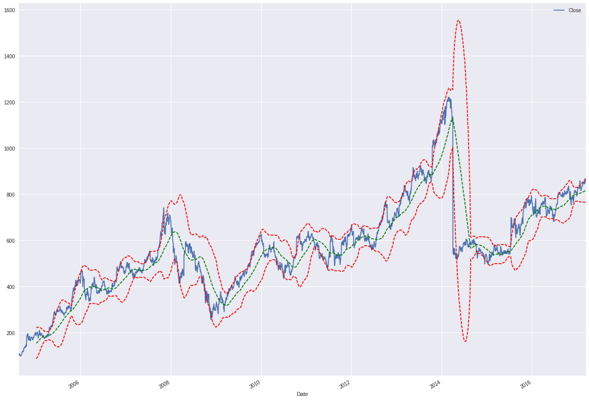

bulbea
======
    *"Deep Learning based Python library for Stock Market Prediction and Modelling."*

Release: v\ |release| (:ref:`Installation <installation>`)

.. image:: https://img.shields.io/gitter/room/bulbea/bulbea.svg
  :target: https://gitter.im/bulbea/bulbea

**bulbea** is an Open Source Python module (released under the :ref:`Apache 2.0 License <license>`) that consists a growing collection of statistical, visualization and modelling tools for financial data analysis and prediction using deep learning.

**bulbea** helps you with

**Financial Data Loading**

.. code:: python

    >>> import bulbea as bb
    >>> share = bb.Share('YAHOO', 'GOOGL') # Get Google's historical data from Yahoo's database
    >>> share.data
                      Open        High         Low       Close      Volume  Adjusted Close
    Date
    2004-08-19   99.999999  104.059999   95.959998  100.339998  44659000.0       50.220219
    2004-08-20  101.010005  109.079998  100.500002  108.310002  22834300.0       54.209210
    2004-08-23  110.750003  113.479998  109.049999  109.399998  18256100.0       54.754754
    ...

**Statistical Vizualization**

.. code:: python

    >>> share.plot(bollinger_bands = True, period = 100, bandwidth = 2)

**bulbea** is created and currently maintained by `Achilles Rasquinha <https://github.com/achillesrasquinha>`_.

**bulbea** officially supports Python 2.7 and 3.5.

Guide - User
++++++++++++

.. toctree::
  :maxdepth: 2

  guides/user/introduction
  guides/user/installation
  guides/user/quickstart

Guide - API
+++++++++++

.. toctree::
  :maxdepth: 2

  guides/api

Blog
++++

.. toctree::
  :maxdepth: 2

  blog/data-data-everywhere
  blog/visualizing-the-market
  blog/artificial-neural-networks
